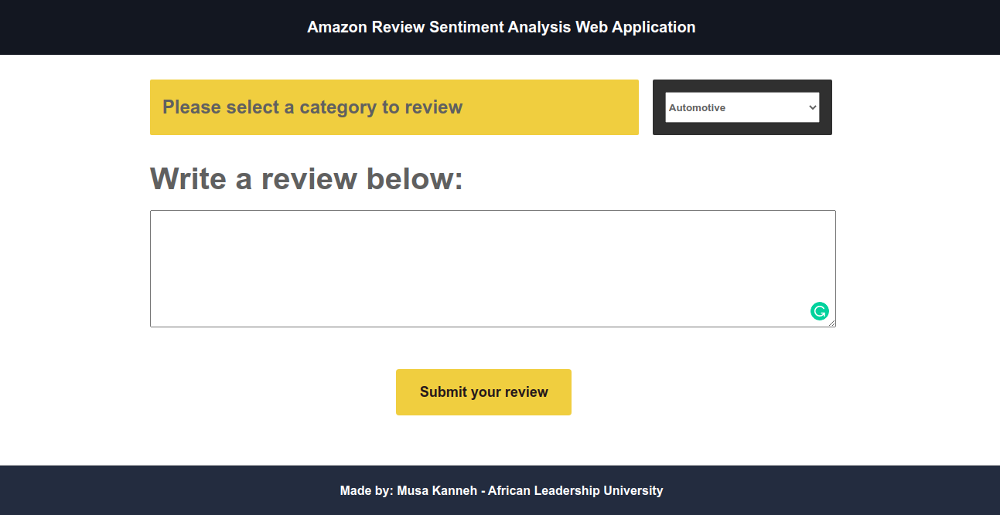

# A Product Review-Based Rating System for E-Commerce Sales
## End result

## Introduction
Recommender systems have influenced and redefined online product marketing based on clients' preferences. This process helps digital enterprises scale their businesses, thus generating more revenue based on product performance analyses. This proposal aims to design and build software that will help Rwanda's e-commerce businesses review customers' feedback on a five-star rating proceeding to improve product marketing and increase revenue generation. The author is highly motivated to implement this project, given his need to leverage his Data Mining skills to help businesses online businesses thrive - using techniques like Natural Language Processing and Sentiment Analysis.
## Problem
Online globally businesses have experienced a significant improvement, admits the CODIV-19 pandemic. Rwanda is of exception. As of August 2020, The country's e-commerce sector (including the startups) has experienced a 17% increase. Rwanda's significant strive in the e-commerce sector has resulted in limited institutional access of review-based rating recommenders to support business operations. Conversely, an e-commerce platform like Amazon has already experienced a 29% increase in its business during this pandemic, with the help of customer review-based recommenders features, among other features (Amazon Online Marketing, 2021). Therefore, upon successful implementation, this project will enhance customer online shopping satisfaction while also enabling e-commerce platforms to make informed business decisions.
## Solution
The system takes a review of various users and processes them using sentiment-based analyses to classify their ratings. Based on the review and analyses, the system will specify whether the E-commerce enterprise's product is either good, bad, or worst - on a scale from one to five. To achieve this, the author will use sentiment-based keywords coupled with positivity or negativity weight from users via a comprehensive user interface (UI) of a web application, rank the ratings and display them via the platform's UI. This system is a web application where users will view various products and give reviews about the merchandise. This system will help many E-commerce enterprises improve or maintain their services based on the customer review and improve the merchandise based on the customer review.
## Objectives
The main objective of the project is to build a system that helps to improve sales on e-commerce platforms. The project’s specific objectives of the system are as follow:
- Get users/customers reviews via the platform regarding a specific rating
- Perform sentiment analysis on the imputed reviews to predict their polarity, using the Apriori algorithm, and collaborative filtering techniques
- Develop the system for users, review and rate products
- The project implementation will begin in February and end in April 2021

## Project Scope
- Product rating will be done from users’ reviews via the platform only
- The system will be accessed via a web-interface; no mobile view support will be provided.
- The system will be limited to testing the proposed functionalities
- The system will be deployed on Heroku to be accessed and used.
- The web application will accept string input from users only
- The projects require no external dataset to function
## Technical Requirements
The following technical tools and requirements will facilitate the development of the system:
- Python programming language: to aid preprocessing, text modeling, and deployment.
- Convolutional Neural Network (KNN): for training the classifier and using user inputs as a test case for which the label is being predicted.
- Sklearn: to feature various classification, regression and clustering algorithms
- Pandas: for representing data and performing basic operations on the dataset.
- Numpy: will be used to normalize and cleaning data
- Apriori algorithm that uses association rules to build our prediction model.
- Flask web framework: to facilitate the backend development

## Project TODOs
- [ ] Implement and classify sentiment analysis
- [ ] ...

## Dataset
Dataset